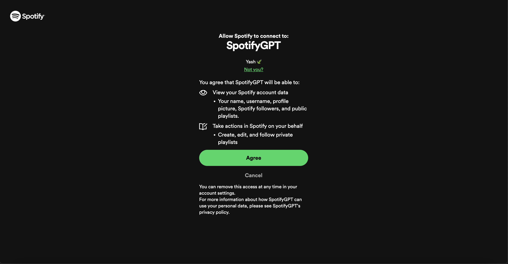
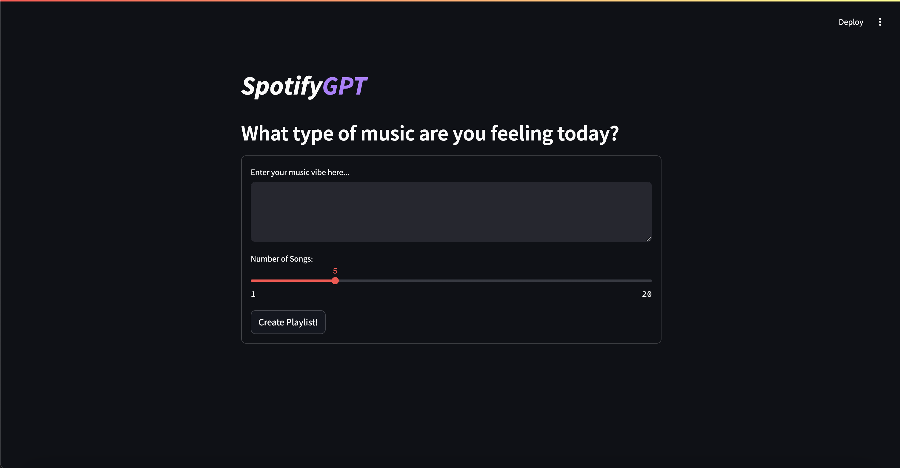
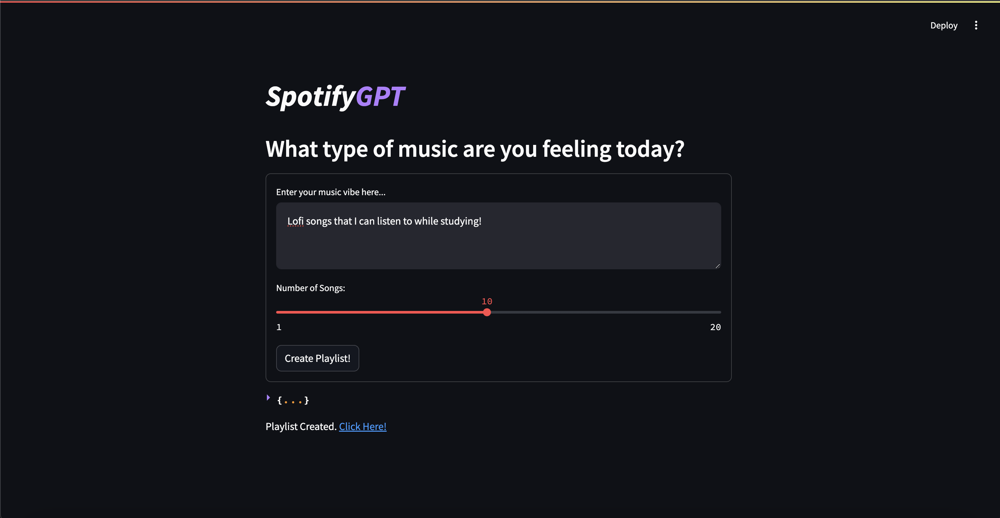
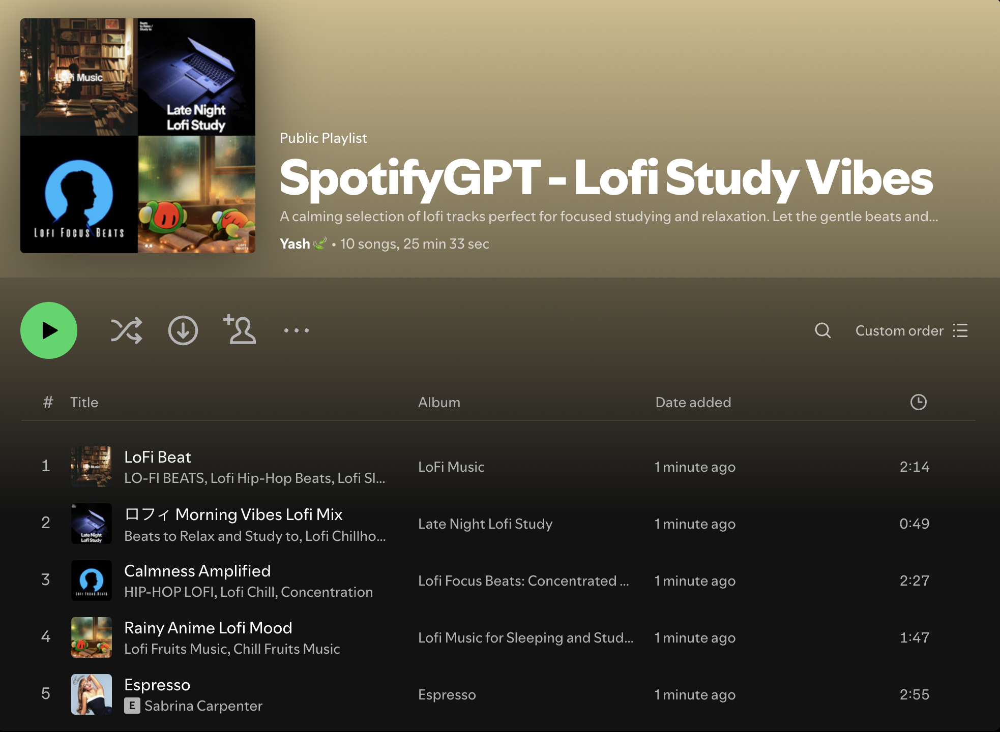

# SpotifyGPT 🎶

SpotifyGPT is a tool that leverages the OpenAI API, alongside the Spotify API to find music based on user prompts, and insert it inside the users Spotify Account!

Users can write any query from general to specific, and choose a number of songs from 1-20.

Click `Create Playlist` and **__BOOM__** you have yourself an awesome playlist.

## Getting Started 🎧

### Prerequisites 📚

To setup and run this project there are a few prerequisites.

1. Python is installed use the command `python --version` or `python3 --version`.
2. Ensure that pip (a package manager) is installed. This comes preinstalled with Python 3.4 and later. Use the command `pip --version`.
3. Install dependencies using pip. This project requires the following packages: spotipy openai streamlit python-dotenv. Use the following command `pip install spotipy openai streamlit python-dotenv` or `pip3 install spotipy openai streamlit python-dotenv`.
4. Create a [Spotify Application](https://developer.spotify.com).
5. Provide the necessary configuration for the application. The website **__MUST__** be `http://localhost:8501`. The REDIRECT URI **__MUST__** be `http://localhost:8502`. Ensure these ports are [available](https://dev.to/rawas_aditya/how-to-kill-processes-and-free-up-ports-on-mac-windows-and-linux-h97) and not being used on your local host/machine.
6. Check all API/SDKS and approve agreement.
7. View your applications settings and copy down the `CLIENT ID` and `CLIENT SECRET`
8. Navigate to the [OpenAI Platform](https://platform.openai.com/docs/overview) and generate an `API KEY` and copy this down.
9. Download the project and inside the folder create a `.env` file. Inside this `.env` file set the following. Add your copied down configuration here and replace "changeme".
```
OPENAI_API_KEY = changeme
SPOTIFY_CLIENT_ID = changeme
SPOTIFY_CLIENT_SECRET = changeme
```
10. Let's Get Started!

### Running The Application 💫

To run the application follow these steps below!

1. Navigate to your folder from the terminal or open it in a IDE/Text Editor (like Visual Studio Code)
2. Run the command `streamlit run spotifyGPT.py`
3. You will be asked to login for authorization/authentication purposes. Ensure the application is given permission to your Spotify Account user. After authorization is complete you can close the window and return back to the website. Also if authorization was successful you will see a `hidden` file in your folder where the project is downloaded.
4. Write a query for some music and choose a number of songs from 1-20. Click `Create Playlist` and see the results. You will be given a link to your playlist that is inside your Spotify Account.
5. Get that vibe on and find some new music!

## Results 📊

You can check out some demos here. These images show the application in more detail.

### Authorization


### Home


### Response


### Results


## Having Trouble...? 🔍

Here are some common issues that I ran into!

ERROR: Port/Address is in use!
SOLUTION: Make sure you kill all processes on ports 8501 and 8502.

PROBLEM: Configuration setup incorrectly?
SOLUTION: Uncomment `LINE: 241` to print your configuration variables from the `.env` file. After running the application see the terminal and check if everything matches!

As always for more problems I recommend to stop the app `CTRL + C`, close all tabs, and restart it.

## Inspiration ✨

I built this AI tool to bridge the gap between Artificial Intelligence and the music industry. With the creation of SpotifyGPT, I solved one of my biggest challenges: discovering new music.

I used to spend countless hours scouring Spotify, searching for songs, and trying to forge the perfect playlists tailored to my taste. Now, with SpotifyGPT, I’ve made AI do it for me.

I hope others find this tool useful.

Groove on! 💃